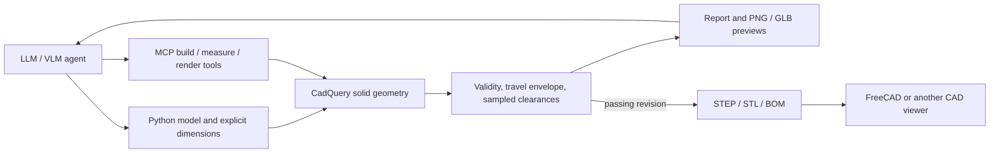

# Machine CAD Agent

Mechanical CAD that an AI agent can edit, rebuild, measure, inspect visually,
and export through code and MCP tools. This is a personal hobby and learning
project developed with AI assistance.

The first model is an **M01 gantry geometry pilot**: a hollow square-tube frame,
two round rails, four supports, two sliding blocks, and a carriage plate.
It is a new parametric study inspired by
[diaper-changing-machines](https://github.com/dylanstechmann/diaper-changing-machines),
with 21 named solid components. The original Blender concepts remain in that
separate repository. This is an initial CAD automation foundation, not the
complete diaper-changing mechanism.


## Run it

Prerequisite: Docker with Compose v2 running. No host Python or paid CAD license
is needed. The first run downloads the pinned CAD dependencies.

Windows PowerShell, from this folder:

```powershell
.\run.ps1
```

macOS / Linux:

```bash
./run.sh
```

This builds the runtime, generates baseline / broken / repaired revisions, and
starts the interactive viewer at **http://127.0.0.1:8765**. The expected sequence
is `pass / fail / pass`. The fault is deliberately excessive carriage travel;
the broken revision keeps diagnostic previews but has no STEP/STL exports.
This scripted demo tests the pipeline, rather than measuring an LLM's ability
to discover a repair.

The viewer is bound to the local computer. It shows an orbitable colored GLB,
six PNG views (including both travel endpoints), measurements, failures,
parameters, provenance, and downloads. Select a revision to inspect the fault.

```powershell
.\run.ps1 test                 # Geometry and real stdio MCP tests
.\run.ps1 build                # Rebuild the canonical baseline
.\run.ps1 parameters           # Defaults and override schema
.\run.ps1 stop                 # Stop the viewer
```

The shell wrapper supports the same commands. Direct container commands also
work:

```bash
docker compose run --rm -T dev python -m machine_cad build --patch '{"travel_mm":400}' --label longer-travel
```

On Windows, use MCP overrides or edit `configs/m01.json` to avoid native-shell
JSON quoting differences. Source is mounted into the container, so Python and
configuration edits are picked up by the next build. Rebuild the Docker image
after changing dependencies. Generated files are in `builds/` and are ignored
by Git.

## Connect the AI tools

After the first run, register this checkout with Codex:

```powershell
.\scripts\register-codex.ps1
```

Start a fresh Codex session in this project to load `machine_cad_agent`.
Codex must recognize the checkout as a trusted project to expose its MCP tools;
confirm project trust when opening a new clone.
The registration launches Docker on demand using absolute paths to this
checkout. It adds one stdio MCP server to the user's Codex configuration.
Other MCP clients can use the same command:

```text
docker compose --project-directory /absolute/path/to/machine-cad-agent -f /absolute/path/to/machine-cad-agent/compose.yaml run --rm -T dev python -m machine_cad.mcp_server
```

The CAD server needs no API key. The connected LLM/VLM is supplied by the agent
client. Codex can edit the Python model and config with its file tools, then
use these MCP operations:

| Tool | Result |
| --- | --- |
| `get_parameters` | Current defaults and bounded input schema, in mm |
| `check_model` | Actual solid measurements and geometric failures for a proposal |
| `build_model` | Regenerate geometry, check, render, and conditionally export |
| `inspect_model` | Detailed revision report, inputs, source hash, artifact hashes |
| `measure_part` | A named part's volume, dimensions, and assembly placement |
| `render_views` | Native PNG image content a VLM can inspect |
| `export_files` | File list for a fresh passing revision; refuses failed/stale builds |

Example task for an agent:

> Inspect the current parameters. Make a trial with 400 mm total carriage
> travel using build_model. Read the numeric report and inspect both endpoint
> images with render_views. Measure carriage_plate and list the exports if all
> checks pass. Persist the config only after reviewing the revision.

Per-build overrides do **not** rewrite the baseline. Persistent changes belong
in Python or `configs/m01.json`. Follow [AGENTS.md](AGENTS.md) for evidence and
revision discipline.

## Architecture and files



- `src/machine_cad/model.py`: authoritative named parts and placements.
- `configs/m01.json`: authoritative default dimensions, all in millimeters.
- `validation.py`: solid validity, conservative travel envelope, and geometric
  intersection/distance checks at the reported motion samples.
- `pipeline.py`: builds, rendered views, export gate and SHA256 provenance.
- `mcp_server.py`: structured feedback and native images for agents.
- `web/`: local read-only artifact viewer; bundled model-viewer works offline.
- `tests/`: geometry, STEP reimport, parameter rejection and real MCP roundtrips.
- `.github/workflows/cad.yml`: the same build/tests/demo on GitHub, with artifacts
  retained for seven days.

Passing builds contain one assembly STEP, 21 individual STEP files, six STL
part studies (the supports and sliding blocks), BOM CSV, parameter JSON, and
report JSON. The plate is a fabricated-part study supplied as STEP. Parts are
exported at their local origin; the assembly supplies their placements.
STEP can be inspected in FreeCAD or other engineering CAD tools; FreeCAD is
not required or installed by this project. Blender can remain useful for
presentation work.

The build ID identifies effective parameters, source and key dependency
versions. Reports include file hashes. Rebuilding the same inputs reproduces
the geometry; export timestamps and serialization are not promised to be
byte-identical. Editing source or the baseline config marks older builds stale.

## Evidence and limits

The baseline is 600 × 400 mm with a 360 mm frame height, a 100 × 200 × 8 mm
carriage plate, 360 mm total travel, and a measured 0.25 mm radial block/rail
gap. The default five motion samples include both endpoints and the center.
An independent conservative travel envelope prevents sparse sampling from
allowing the carriage to leave the rails or jump past end supports.

A passing report establishes the listed geometric checks. It does not
establish strength, dynamics, tolerance robustness, wear, hygiene, controls,
or child-use suitability. Stock, rail and bearing shapes are nominal
envelopes without vendor compatibility claims. Fasteners, mounting/clamping
details, actuation and a changing surface are not modeled. The prototype has
not been built or physically tested. [Validation record](docs/VALIDATION.md)
distinguishes agent-run checks from physical work.

## Credits

- [CadQuery](https://cadquery.readthedocs.io/en/stable/): Python parametric solid
  modeling and STEP/STL/SVG exports, using the Open CASCADE geometry kernel.
- [MCP Python SDK](https://py.sdk.modelcontextprotocol.io/): agent protocol,
  structured tool results and image content.
- [CairoSVG](https://cairosvg.org/): SVG-to-PNG rendering.
- Google's [model-viewer](https://modelviewer.dev/): local GLB preview. Its
  bundled license and pinned source metadata are in `web/vendor/`.
- [Codex MCP documentation](https://developers.openai.com/codex/mcp/): client
  registration and configuration.

Project source is MIT licensed; dependencies retain their own licenses.
